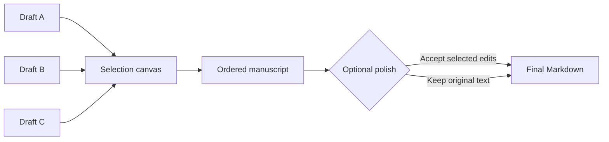

# Draft Weave

**Pick the paragraphs you trust, assemble the manuscript you want, and review connective edits one by one.**

[简体中文](README.zh-CN.md) · [Model setup](docs/MODELS.md) · [Development guide](docs/DEVELOPMENT.md)

Writers often have several drafts where each version contains something worth keeping: one has the right structure, another explains a section better, and a third has the strongest ending. Draft Weave provides a visual canvas for combining those pieces without surrendering control of the final text.

## What it does

- Import Markdown or plain-text drafts.
- Select an entire chapter, a section, or individual paragraphs from each source.
- Reorder, replace, edit, and lock blocks in the assembled manuscript.
- Preview the exact concatenated result before any rewriting.
- Ask an optional model for whole-document connective edits, then accept or reject every suggestion separately.
- Export Markdown or save a project file that preserves sources, selections, locks, and review decisions.



## Quick start

Requires Node.js 22 or later and a modern browser. There are no runtime npm dependencies and no build step.

```sh
node server.mjs
```

Open `http://127.0.0.1:6410` and use the sample drafts, paste text, or import `.md` / `.txt` files.

The core workflow is deliberately direct:

1. Choose paragraphs from one or more sources.
2. Arrange them on the manuscript canvas.
3. Edit or lock blocks that must remain unchanged.
4. Preview the literal assembly.
5. Export Markdown, or review optional connective edits before exporting.

## Human-controlled polishing

Draft Weave never replaces the manuscript with a single opaque model rewrite. When a model is configured, it returns discrete suggestions tied to the current text. Each suggestion can be accepted or rejected, and edits become stale if the relevant manuscript changes.

Two optional backends are supported:

- an OpenAI-compatible external API using your endpoint and key environment variable;
- a local Codex CLI profile using normal ChatGPT sign-in and account allowance.

Offline assembly and export continue to work without either backend. See [model setup](docs/MODELS.md).

## Local-first drafts

Automatic drafts live in the browser. Each open window receives its own safe copy, and conflicting windows do not silently replace one another. For portable backup or cross-browser work, use **Save project** and keep the exported project file.

Server-side exports and optional runtime data stay in the project directory by default. Set `DW_DATA_DIR` before starting the server to keep writing data in a separate location:

```powershell
$env:DW_DATA_DIR = 'D:\Writing\draft-weave-data'
node server.mjs
```

## Designed for

- merging interview, report, proposal, or essay drafts;
- creating one approved narrative from several agent-generated alternatives;
- preserving exact passages while improving transitions around them;
- reviewing editorial changes as decisions rather than accepting a full rewrite.

## Scope

- Input is Markdown or plain text; DOCX import is outside this editor’s scope.
- Headings, paragraphs, blank lines, and fenced code are preserved as blocks. Draft Weave is not a full rich-text or CommonMark rendering engine.
- Number, unit, and quotation guards catch common changes but do not verify factual correctness.
- Browser drafts are local working state, not a substitute for an exported project backup.

## Repository guide

- [`public/`](public/) — the selection canvas and browser logic
- [`server/`](server/) — local server, storage boundaries, and model bridge
- [`examples/`](examples/) — sample source drafts
- [`docs/MODELS.md`](docs/MODELS.md) — optional model configuration

## Contributing

```sh
npm test
```

Issues and pull requests are welcome for selection ergonomics, import behavior, accessible editing, and suggestion review.

Licensed under the [MIT License](LICENSE).
