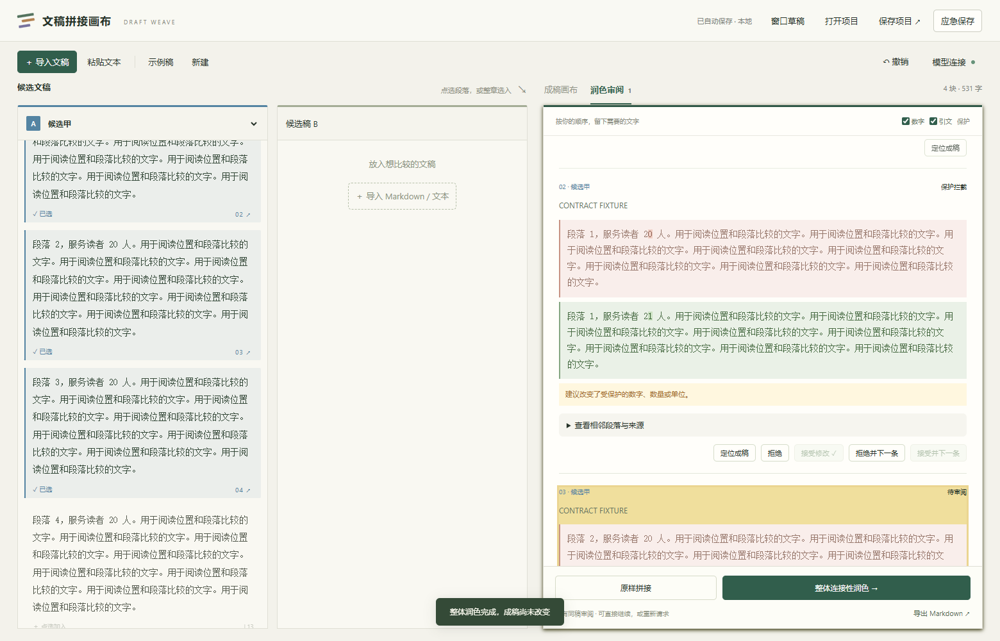
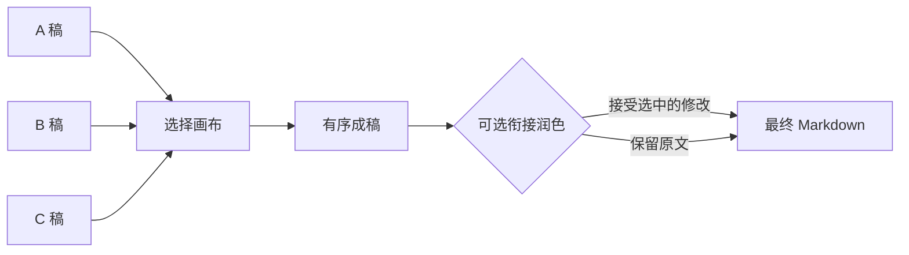

# Draft Weave · 文稿拼接画布

**从多份草稿中挑出真正想保留的段落，拼成目标文稿，再逐条审阅衔接润色。**

[English](README.md) · [模型配置](docs/MODELS.md) · [开发说明](https://github.com/liulinlin718-netizen/draft-weave/blob/codex/public-release/docs/DEVELOPMENT.md)

多轮写作经常留下几份各有优点的草稿：A 稿结构最好，B 稿某一节更清楚，C 稿结尾最有力。Draft Weave 提供一个可视化拼接画布，让你直接选择和组合这些内容，并始终保留对最终文字的控制权。

## 实际效果



真实浏览器截图，使用合成文稿和明确标记的模型测试样本。建议把受保护数字从 **20 改成 21**：画布显示文字差异、标记冲突，并禁用接受操作；同一张审阅卡中可以展开相邻段落和来源原文。

用 `node server.mjs` 启动后导入候选稿，选段拼成正文，并锁定必须保留的内容。**应急保存**可下载包含来源、改文、锁定和审阅状态的恢复文件，不含撤销历史。图中展示审阅保护机制，不代表模型写作质量。

## 它能做什么

- 导入 Markdown 或纯文本草稿。
- 按整章、章节或单个段落从不同来源中选择内容。
- 对部分选中的章节“按原序补齐”，保留人工改文与锁定，并保持来源栏阅读位置。
- 在成稿画布中排序、替换、编辑和锁定段落。
- 在任何改写之前预览原样拼接结果。
- 可选调用模型提出全文衔接建议，每条建议都单独接受或拒绝。
- 导出 Markdown，或保存包含原稿、选择、锁定和审阅决定的项目文件。
- 撤销历史导致完整保存过大时，直接下载保留当前状态的应急项目文件。



## 快速开始

需要 Node.js 22 或更高版本和现代浏览器。项目没有运行时 npm 依赖，也不需要构建。

```sh
node server.mjs
```

打开 `http://127.0.0.1:6410`，可以直接使用示例、粘贴文本，或导入 `.md` / `.txt` 文件。

核心流程只有五步：

1. 从一份或多份原稿中选择段落。
2. 在成稿画布中安排顺序。
3. 编辑段落，或锁定绝不能被改写的内容。
4. 预览原样拼接结果。
5. 直接导出，或先逐条审阅可选的衔接修改。

## 人工掌控的润色

Draft Weave 不会用一次不可见的模型重写替换整篇成稿。配置模型后，它返回与当前文字绑定的离散建议。每条建议都可以单独接受或拒绝；相关正文改变后，旧建议会被标记为过期。

每张审阅卡片都能展开相邻段落和来源原文。“接受并下一条”或“拒绝并下一条”会定位下一处待审建议；保护拦截和过期修改仍然不能接受。

发送前会检查是否所有段落都已锁定，以及完整请求是否超过输入上限。请求保留所有候选原稿，超限时由你调整内容。当前完整输入与后端配置仍匹配已有审阅时，可以选择“继续已有审阅”，无需再次请求模型，也可以明确发起“重新润色”。请求记录显示大小、耗时和后端返回的用量；没有返回用量不等于零费用。

支持两种可选后端：

- 使用自有端点和密钥环境变量的 OpenAI 兼容外部 API；
- 通过正常 ChatGPT 登录和账号额度运行的本地 Codex CLI 独立 profile。

未配置模型时，离线拼接和导出仍然完整可用。具体配置见[模型说明](docs/MODELS.md)。

## 本地草稿与数据

自动草稿保存在浏览器中。每个窗口拥有独立安全副本，冲突窗口不会互相静默覆盖。需要跨浏览器或长期备份时，请使用“保存项目”并保留导出的项目文件。

输入时先记录按段落保存的小型恢复日志，在停顿、最长间隔或离开编辑框时保存完整检查点；连续编辑只占一个撤销步骤。存储失败会提示恢复入口并保留最后保存的副本。如果新的输入日志也无法保存，请在关闭窗口前下载当前项目或输入恢复记录。

“应急保存”直接通过浏览器下载 `.current.draftweave.json`，保留来源、当前正文、锁定、保护设置和审阅决定，省略撤销历史。用“打开项目”即可恢复。它不会另建服务端导出、自动删除旧稿或扩大浏览器容量。

服务端导出和可选运行数据默认留在项目目录。启动前设置 `DW_DATA_DIR`，可以把写作数据放到独立位置：

```powershell
$env:DW_DATA_DIR = 'D:\Writing\draft-weave-data'
node server.mjs
```

## 适用场景

- 合并访谈稿、报告、方案或长文的多个版本；
- 从多份 Agent 生成稿中形成一份经过选择的叙事；
- 保留关键原话，只改善它们之间的连接；
- 把编辑修改变成逐条决定，而不是整篇接受模型重写。

## 使用边界

- 输入为 Markdown 或纯文本，不提供 DOCX 导入。
- 标题、段落、空行和围栏代码会作为块保留；它不是完整的富文本或 CommonMark 渲染器。
- 数字、单位和引文保护能发现常见变化，但不验证事实是否正确。
- 浏览器草稿是本地工作状态，不能替代导出的项目备份。

## 仓库结构

- [`public/`](public/)：选择画布与浏览器逻辑
- [`server/`](server/)：本地服务、数据边界和模型桥接
- [`examples/`](examples/)：示例原稿
- [`docs/MODELS.md`](docs/MODELS.md)：可选模型配置

## 参与贡献

```sh
npm test
```

欢迎围绕选择体验、导入行为、无障碍编辑和建议审阅提交 Issue 或 PR。

本项目采用 [MIT License](LICENSE)。
